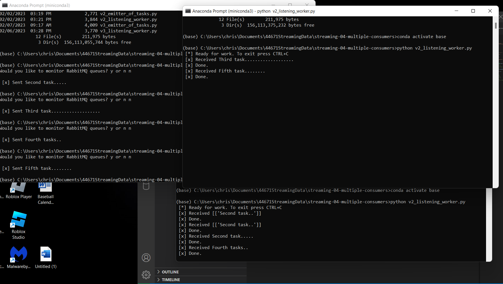

# Chris Kollbaum

2/6/2023

We have three version of the emitter and listener codes.  Versions 1 and 2 basically do the same thing, but version 2 is the more standard approach.  These send tasks to workers one at a time.  In version 3 we are working with code similar to version 2, but we have modified it to send tasks one by one from the task.csv file with two workers recieving the various tasks.  One worker recieves one task while the other recieves the next and so on in that pattern.    

# streaming-04-multiple-consumers

> Use RabbitMQ to distribute tasks to multiple workers

One process will create task messages. Multiple worker processes will share the work. 

## Before You Begin

1. Fork this starter repo into your GitHub.
1. Clone your repo down to your machine.
1. View / Command Palette - then Python: Select Interpreter
1. Select your conda environment. 

## Read

1. Read the [RabbitMQ Tutorial - Work Queues](https://www.rabbitmq.com/tutorials/tutorial-two-python.html)
1. Read the code and comments in this repo.

## RabbitMQ Admin 

RabbitMQ comes with an admin panel. When you run the task emitter, reply y to open it. 

(Python makes it easy to open a web page - see the code to learn how.)

## Execute the Producer

1. Run emitter_of_tasks.py (say y to monitor RabbitMQ queues)

Explore the RabbitMQ website.

## Execute a Consumer / Worker

1. Run listening_worker.py

Will it terminate on its own? How do you know? I don't believe it does.  You must hit control +c to terminate the program.  

## Ready for Work

1. Use your emitter_of_tasks to produce more task messages.

## Start Another Listening Worker 

1. Use your listening_worker.py script to launch a second worker. 

Follow the tutorial. 
Add multiple tasks (e.g. First message, Second message, etc.)
How are tasks distributed? The two listening terminals take turns recieving the tasks.  
Monitor the windows with at least two workers. 
Which worker gets which tasks?  One worker gets the first task.  The other gets the next and so on.  

## Reference

- [RabbitMQ Tutorial - Work Queues](https://www.rabbitmq.com/tutorials/tutorial-two-python.html)

# Screenshot

## Version 1 Screenshot

## Version 2 Screenshot

## Version 3 of Emitting and Listening Code

